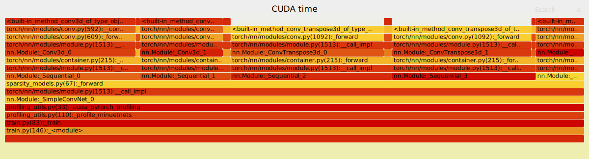

This repository contains supplementary data and visualizations for the analysis of sparsity in neural networks.

## Interactive Flame Graph

You can hover over the individual elements in the flame graph to see more details.

Other SVG files:

- [Minuet](svg/minuet.svg)
- [Torch Sparse](svg/torchsparse.svg)
